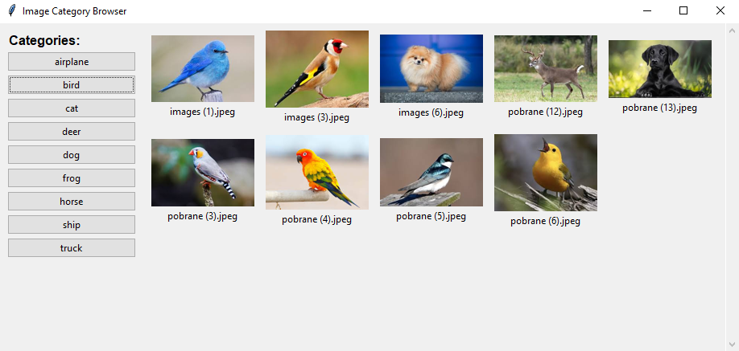

# 🖼️ Images Classifier
> This project simplifies the process of classifying images using a trained neural network and a user-friendly desktop GUI. It allows users to upload, view, and classify images with a model trained on CIFAR-10.

## Table of Contents
* [General Information](#general-information)
* [Technologies Used](#technologies-used)
* [Features](#features)
* [Model Details](#model-details)
* [Screenshots](#screenshots)
* [Setup](#setup)
* [Usage](#usage)
* [Project Status](#project-status)
* [Room for Improvement](#room-for-improvement)
* [Contact](#contact)

## General Information
- PyTorch-based desktop image classification tool with a graphical interface built in PyQt5.
- The classifier uses a trained neural network to categorize images into 10 classes from the CIFAR-10 dataset.
- Designed to be intuitive and lightweight for users with minimal coding experience.

## Technologies Used
- **Python**: 3.8+
- **PyTorch**: 2.x
- **PyQt5**: 5.15+
- **Pillow**: for image processing
- **PyYAML**: for configuration loading
- **NumPy**

## Features
### Core Functionality
- Image classification using a trained CNN.
- GUI for uploading, displaying, and classifying images.
- Configuration via a YAML file.

### Supporting Modules
- `ImageHandler`: Loads and preprocesses images (resize, normalize).
- `NetHandler`: Loads the model and runs inference.
- `configuration.yaml`: Centralized app config (model path, label names, image settings).

## Model Details

### Architecture
The included model is a Convolutional Neural Network (CNN) trained from scratch on CIFAR-10. It consists of:
- 2 convolutional layers (with ReLU activation and MaxPooling)
- 2 fully connected (dense) layers
- Final output layer with 10 neurons (softmax-style classification)

Excerpt from PyTorch:

    self.conv1 = nn.Conv2d(3, 6, 5)
    self.pool = nn.MaxPool2d(2, 2)
    self.conv2 = nn.Conv2d(6, 16, 5)
    self.fc1 = nn.Linear(16 * 5 * 5, 120)
    self.fc2 = nn.Linear(120, 84)
    self.fc3 = nn.Linear(84, 10)

### Dataset
- **CIFAR-10**: 60,000 32x32 color images across 10 categories:
  airplane, automobile, bird, cat, deer, dog, frog, horse, ship, truck.
- Train/test split: 50,000 training images / 10,000 testing images.

### Training Info
- Number of epochs: 10
- Optimizer: Adam
- Loss function: CrossEntropyLoss
- Learning rate: 0.001
- Accuracy: Typically around 70–75% on test data.

### Loading custom model
To load custom mode

1. Set up your Python environment (see [Setup](#setup)).
2. Use dataset of your choice and include the ordered list of categories under:
   `data/categories.txt`
3. Define the CNN architecture (or reuse the one from this repo).
4. Train using the **Adam** optimizer and **CrossEntropyLoss**.
5. Save your trained model
6. Update configuration details in `configuration.yaml`.

### Limitations
- Model is not designed for production or high accuracy.
- Limited generalization for real-world (non-CIFAR) images.
- Meant for experimentation, learning, and quick tests in GUI apps.


## Screenshots



## Setup

1. **Clone the repository**:

   ```bash
   git clone https://github.com/SailNCode/images-classifier.git  
   cd images-classifier
   ```

2. **(Optional) Create virtual environment**:

   ```bash
   python -m venv venv  
   source venv/bin/activate      # macOS/Linux  
   .\venv\Scripts\activate       # Windows
   ```

3. **Install dependencies**:

   ```bash
   pip install -r requirements.txt
   ```

## Usage

1. **Run the program**:
   
   ```bash
   python main.py
   ```

> ⚠️ Launch from project root to avoid path errors.

## Project Status
Project is: _Finished_

- Fully working GUI
- Pre-trained model ready to use
- Stable for small-scale image testing

## Room for Improvement

1. **Drag & Drop support** in GUI
2. **Custom dataset support**

## Contact
- **SailNCode**: [GitHub Profile](https://github.com/SailNCode)
